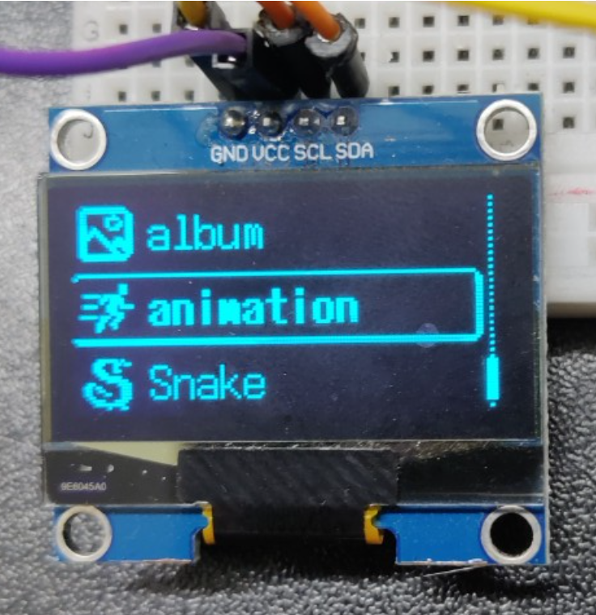
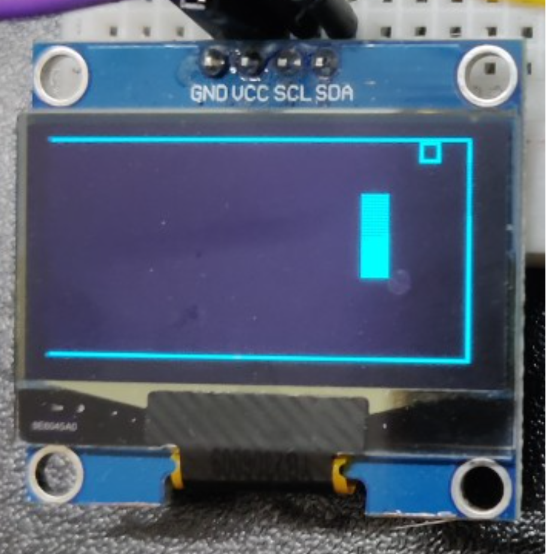
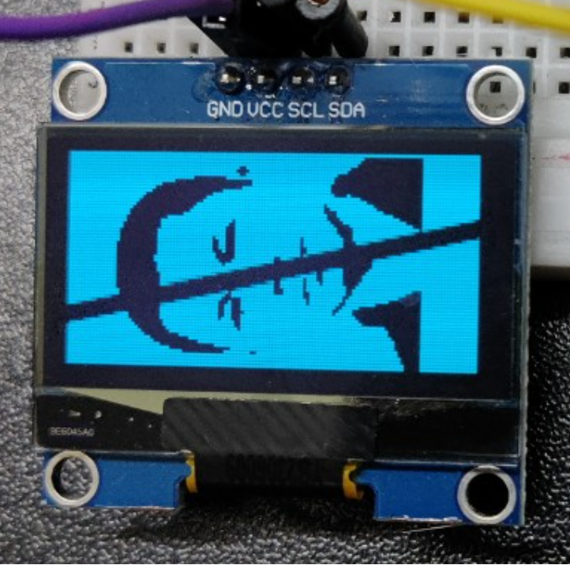
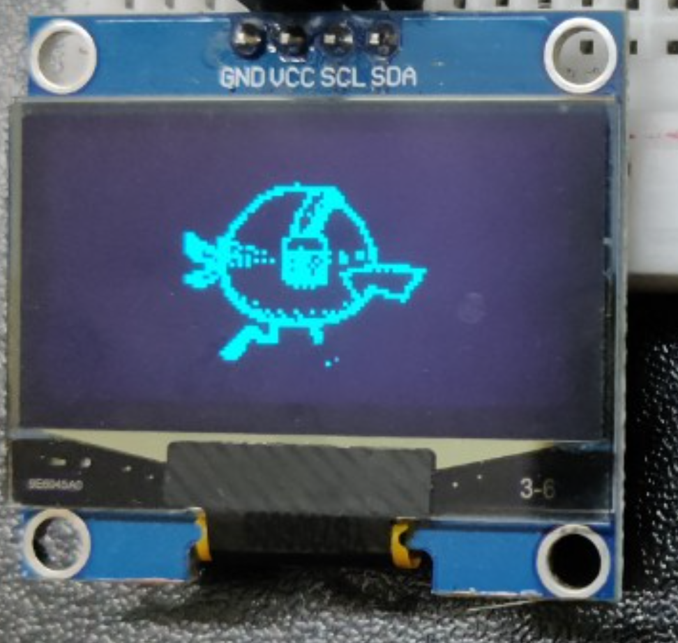
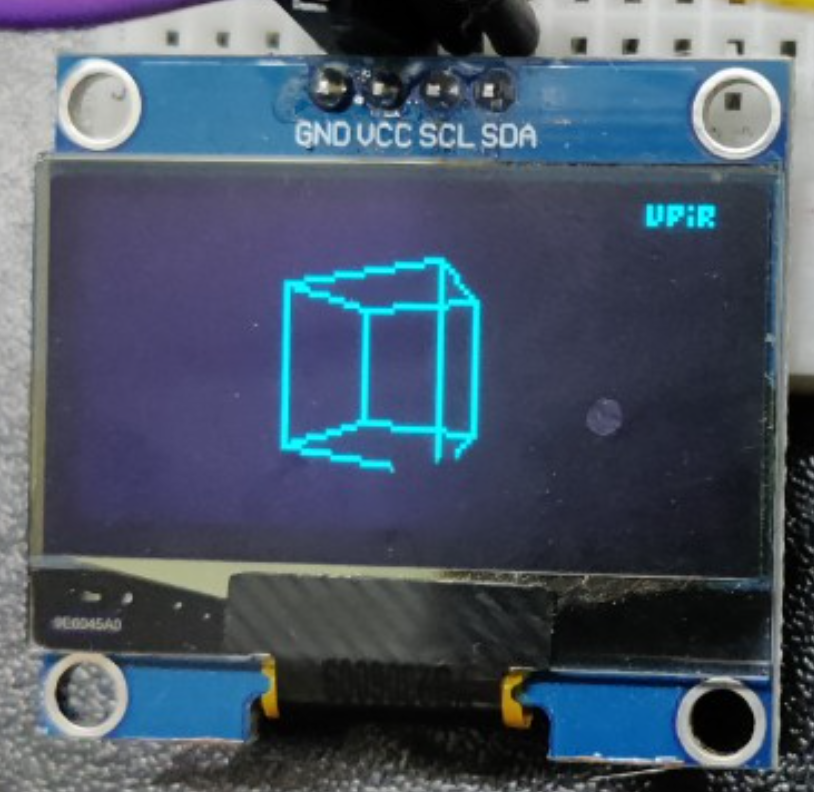

# Game console 
## Reference
- [img2cpp](https://javl.github.io/image2cpp/): Tool convert image images into byte arrays 
- [Silde]()
- [Report]()
- [Video]()
## Set up
### Requirement
- esp32
- ssd1306
- joy-stick
### Diagram

### Lib
- U8g2
- Adafruit SSD1306
## Main
### Menu

1. Snake game
2. Avatar 
3. Flappy bird 
4. Animation
5. Album
### Snake game

### Avatar

### Flappy bird

### Animation

A bird is running
### Ablum

For more image, check [album folder](img/5_album/)