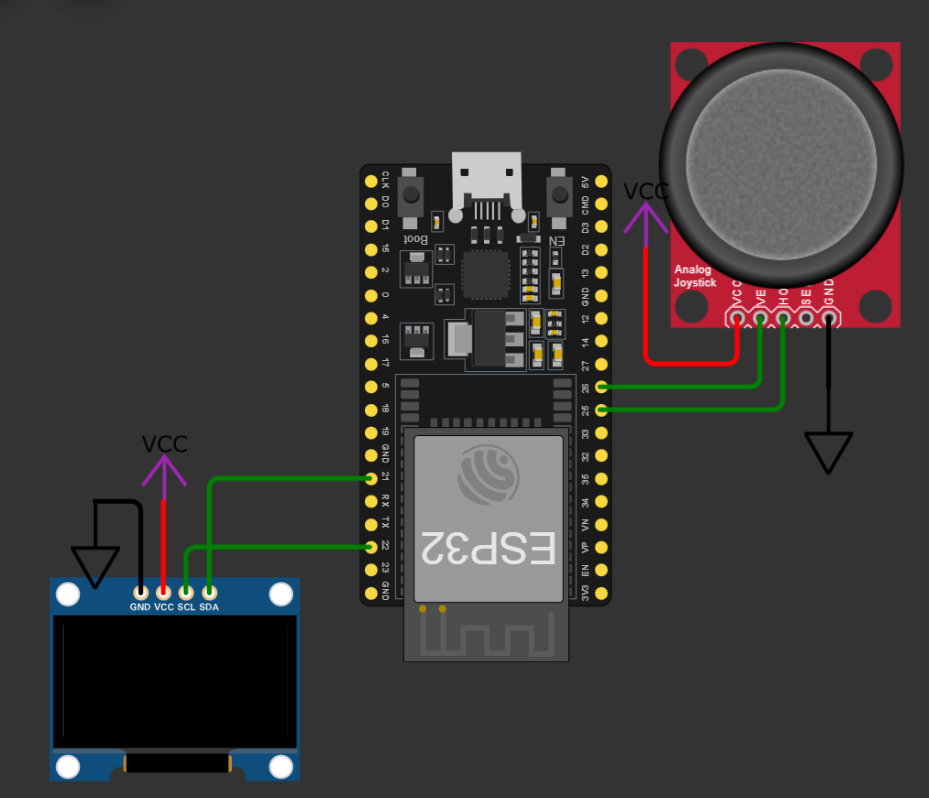

# Game console 
## Reference
- [img2cpp](https://javl.github.io/image2cpp/): Tool convert image images into byte arrays 
- [Silde]()
- [Report](https://husteduvn-my.sharepoint.com/:w:/g/personal/khanh_ln200316_sis_hust_edu_vn/EaKFtKiXNA1NnXZNCWmKQJABjwgVw1ZZr3jWnTF3Mi5mgw?e=EU35Pl)
- [Video]()
## Set up
### Requirement
- esp32
- ssd1306
- joy-stick
### Diagram

### Lib
- U8g2
- Adafruit SSD1306
## Main
### Menu

1. Snake game
2. Avatar 
3. Flappy bird 
4. Animation
5. Album
### Snake game

### Avatar

### Flappy bird

### Animation

A bird is running
### Ablum

For more image, check [album folder](img/5_album/)
## System structure
[main.ino](main\main.ino):  control main stream, display menu bar, and display application when user select
[setup.h](main\setup.h): save enviroment variable of this project
[nano_bird.h](main\nano_bird.h): flappy bird game, save byte file of this game
[animation.h](main\animation.h): save byte of animation screen
[nake.h](main\snake.h): snake game controller
[icon.h](main\icon.h): save icon and album image
## Scalability
- Increase number of `NUM_ITEM` and add to `menu_item` in [setup.h](main\setup.h)
- Add new scenario in [main.ino](main\main.ino) if the `item_selected == New_item`
- Add new `.h` file for this application